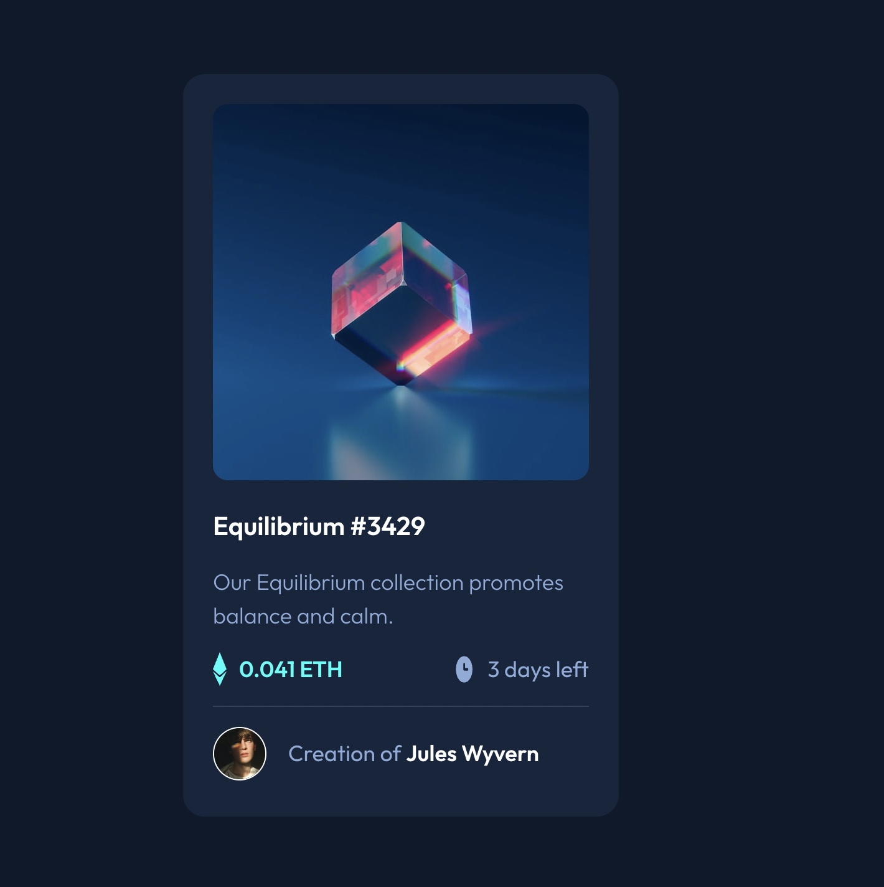

# Frontend Mentor - NFT preview card component solution

This is a solution to the [NFT preview card component challenge on Frontend Mentor](https://www.frontendmentor.io/challenges/nft-preview-card-component-SbdUL_w0U). Frontend Mentor challenges help you improve your coding skills by building realistic projects. 

## Table of contents

- [Frontend Mentor - NFT preview card component solution](#frontend-mentor---nft-preview-card-component-solution)
  - [Table of contents](#table-of-contents)
  - [Overview](#overview)
    - [The challenge](#the-challenge)
    - [Screenshot](#screenshot)
    - [Links](#links)
  - [My process](#my-process)
    - [Built with](#built-with)
    - [What I learned](#what-i-learned)
  - [Author](#author)


## Overview

### The challenge

Users should be able to:

- View the optimal layout depending on their device's screen size
- See hover states for interactive elements

### Screenshot



### Links

- Solution URL: [Add solution URL here](https://your-solution-url.com)
- Live Site URL: [Live Solution](https://fe-mentor-nft-preview-card.vercel.app/)

## My process

### Built with

- Semantic HTML5 markup
- CSS
- Flexbox
- absolute positioning


### What I learned
I learned how to do an image overlay. Below is a container with 2 images inside it. They are used to overlay the innermost image over the top image. 

I use absolute positioning and a transform to put the inner image center on the top image. 

Then adding the hover affect to make the inner image only shown on hover.

To see how you can add code snippets, see below:

```html
<div class="image-container">
  
  <div class="image-overlay">
    
  </div>
</div>
```
```css
.image-container {
  position: relative;
  overflow: hidden;
  border-radius: 12px;
}

.image-container img {
  width: 100%;
}

.image-container img:hover .overlay {
  opacity: 1;
}

.image-overlay {
  display: none;
  position: absolute;
  height: 100%;
  width: 100%;
  top: 0;
  left: 0;
  background-color: hsla(178, 100%, 50%, 0.5);
  margin: auto;
} 

.image-overlay img {
  position: absolute;
  width: 50px;
  top: 50%;
  left: 50%;
  transform: translate(-50%, -50%);
}

.image-container:hover .image-overlay {
  display: block;
}
```

## Author
- Website - [Add your name here](https://www.your-site.com)
- Frontend Mentor - [@chrisdiebold](https://www.frontendmentor.io/profile/chrisdiebold)
- Twitter - [@@cc_diebold](https://www.twitter.com/cc_diebold)